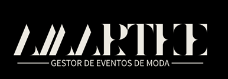
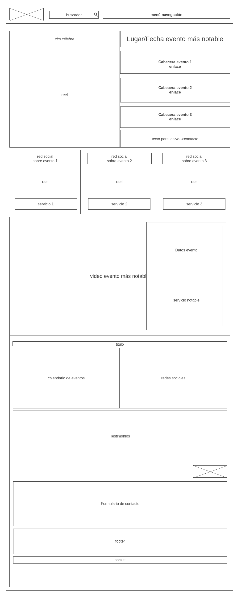
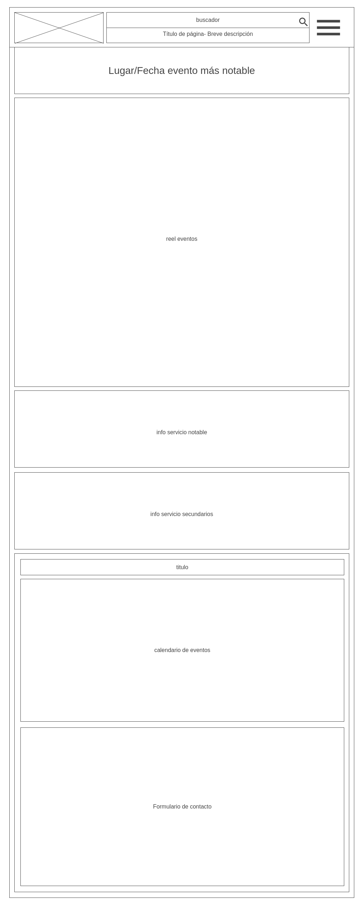

# proyecto amarthe
---

---

## Introducción

*Amarthe* se posiciona como una página de referencia que brinda información detallada sobre eventos relacionados con la industria de la moda. Nuestra misión principal es conectar a nuestros usuarios con experiencias enriquecedoras, talleres, seminarios, ferias y otras actividades que son el foco central de nuestra empresa.

Estamos comprometidos en atender tanto a empresas interesadas en organizar sus propios eventos como a usuarios individuales que buscan disfrutar de estas experiencias únicas. Valoramos enormemente la comunicación directa con nuestros usuarios, y por lo tanto, facilitamos la interacción a través de un formulario de contacto.

Además, ofrecemos la opción de suscribirse a nuestras newsletters y recibir información detallada sobre aspectos específicos del mundo de la moda y los eventos que organizamos.

 Su creadora, **Alba Martín Herrera**, es una profesional graduada en **Protocolo, Organización de Eventos y Comunicación Corporativa** por la Universidad Rey Juan Carlos de Madrid. Su amplia experiencia y títulos en este campo enriquecen la calidad de nuestros servicios y nos permiten ofrecer eventos de moda de alto nivel.
 

Con un diseño elegante y sofisticado refleja la estética y el estilo de la moda que promueve. Se basa en la premisa de "menos es más". Utiliza un enfoque limpio y despejado que elimina el exceso de elementos visuales y distracciones innecesarias. 

La paleta de colores seguirá una gama de colores neutros o tonos suaves que transmitan una sensación de calma y elegancia.

---
## Sobre el nombre de la página

*Amarthe* es una combinación de las palabras “amor” y “arte” y además es el acrónimo del nombre de su joven fundadora que aúna en este proyecto sus grandes pasiones: arte y moda, conjugado con una gran dosis de pasión. Agregando su nombre a la marca, impregna un toque personal y único.

---

## Wireframe inicial

La página se encuentra en su fase inicial de desarrollo y actualmente sigue el siguiente formato. Sin embargo, es importante tener en cuenta que podrían surgir ciertas variaciones a medida que avance el proyecto y se tomen decisiones específicas en función de las necesidades y preferencias del cliente.

El formato de nuestra página está diseñado para ser compatible con diversos dispositivos, y asegurar que la misma rotación del dispositivo no influya en su uso, garantizando así una experiencia de navegación óptima en cualquier plataforma. Nuestra prioridad es brindar una experiencia de usuario excepcional, independientemente del dispositivo que se utilice.

**Diseño web**

**Diseño móvil**

 